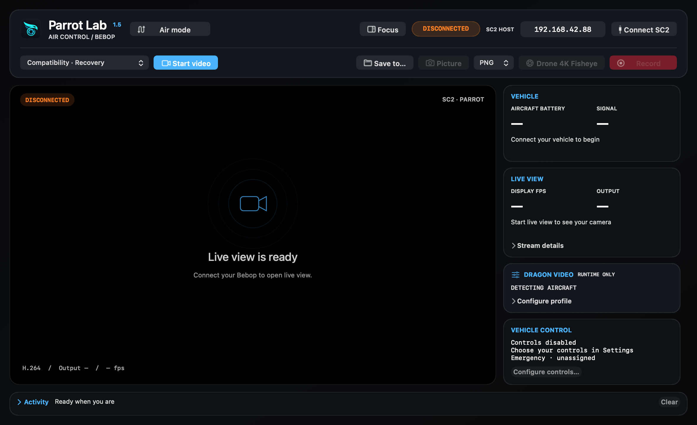
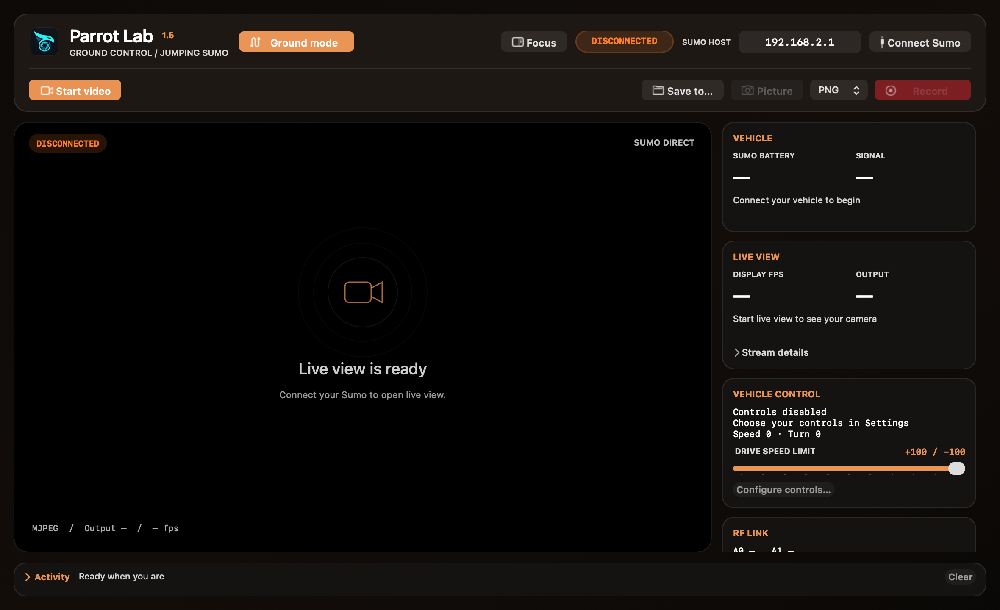

# Parrot Lab for macOS

Parrot Lab is a native macOS HUD and diagnostic client for the Parrot
SkyController 2, Bebop Drone (BB1), Bebop 2, and Jumping Sumo. It is intentionally built from
Apple system frameworks rather than Electron or an embedded browser.

See [CHANGELOG.md](CHANGELOG.md) for the V1.5 release highlights and known
limitations.

The cockpit keeps connection controls on the first toolbar row and video/media
controls on the second. **Focus** hides the right inspector; **Inspector** brings
it back. Expand **Stream details** for transport statistics and the editable RTP
port, or **Configure profile** for Dragon controls. **Activity** opens the full
event log while its collapsed bar still shows the latest event. Air and ground
workspaces use blue and copper accents respectively.

| Air workspace | Ground workspace |
| --- | --- |
|  |  |

> [!WARNING]
> **Development preview — not flight-ready.** The app now receives live video
> through the established SC2 route, but direct production USB/libmux support is
> not complete. Dragon Lab restarts the drone's flight process and must only be
> used while landed with the props removed. Do not rely on this build as a
> flight display or as a replacement for FreeFlight.

> [!CAUTION]
> **Jumping Sumo support is highly experimental.** When a Sumo is routed
> through the SC2, use either the physical SC2 controls or Parrot Lab controls,
> never both at once. The two independent PCMD streams will fight each other
> and produce stop-start movement. Disable Parrot Lab keyboard/gamepad control
> before driving with the SC2.

The intended production transport is the SC2 mobile link used by FreeFlight: Bebop 2 video and telemetry arrive at `mppd` over Wi-Fi and are forwarded to the mobile client through Parrot's USB `libmux` channels. Version 1.5 does not yet implement that USB video path.

Version 1.5 provides:

- a large **Ground Mode** switch with a brown ground-vehicle theme and a direct
  Jumping Sumo backend (`0x0902`, `_arsdk-0902._udp`);
- native JumpingSumo speed/turn PCMD at 20 Hz with the same bounded keyboard
  and macOS GameController input system used by BB1/BB2;
- codec-neutral ARStream1 fragment/ACK handling, routing BB1 to Annex-B H.264
  and Jumping Sumo to a bounded MJPEG decoder;
- Sumo MJPEG frames flowing through the existing enhancement, MetalFX,
  screenshot and processed H.264 recording pipeline;
- strict capability gating that hides flight/GPS/Dragon/RF controls and never
  sends ARDrone3 flight commands while Ground Mode is active;

- direct, read-only Telnet connection to the SC2 at `192.168.42.88`;
- parsing of the SC2's existing `mppd`, `wifid`, and link-quality telemetry;
- a persistent SC2-routed ARDiscovery/ARNetwork/ARCommands session for
  structured drone battery, flight state, GPS, speed, attitude, satellite and
  camera events;
- automatic BB1/BB2 model detection from the authoritative SkyController
  `ConnexionChanged` product ID (`0x0901` / `0x090c`), with direct Bonjour
  discovery of `_arsdk-0901._udp` and `_arsdk-090c._udp`;
- stock Compatibility video, telemetry, piloting, camera control and genuine
  4K fisheye capture on both BB1 and BB2;
- automatic safety gating that keeps BB2-only modified Dragon, calibrated
  rolling-shutter, persistent-Telnet and RF/MOD workflows disabled on BB1 or
  an unidentified aircraft;
- an optional standalone BB1/BB2 route using direct ARDiscovery at
  `192.168.42.1:44444`, the discovery-returned command port, and announced
  ARStream2 client ports;
- native macOS GameController input for Xbox, PlayStation and MFi controllers,
  plus app-focused remappable keyboard controls that require a safety-hold key
  for movement;
- SC2-style 20 Hz PCMD control, acknowledged take-off/landing/RTH commands,
  camera pan/tilt control, automatic neutral input on focus/connection loss,
  and an intentionally unassigned emergency command;
- per-chain RSSI, noise, SNR, PHY rate, flight state, altitude, attitude, controller battery and temperature;
- a graphical video HUD with the RF Lab red/yellow/green/cyan signal gradient;
- an artificial horizon and live link/video statistics;
- SC2 `/video` restream discovery on the two listeners observed in firmware 1.0.9;
- a UDP/RTP H.264 receiver with FU-A and STAP-A reassembly and low-latency AVFoundation display;
- bounded VideoToolbox H.264 recording of the processed Parrot Lab output;
- an optional developer-only archive of the untouched incoming Annex-B stream;
- original-quality H.264-to-MP4 remuxing plus an optional quality-controlled
  H.264 re-encode from the native **Video** menu;
- PNG or JPEG capture of the latest processed output frame at the selected
  enhancement/MetalFX resolution;
- independent Core Image enhancement and configurable Apple MetalFX Spatial
  output up to 3840 × 2160, shared by live view, stills and normal recording;
- optional GPU H.264 artifact repair for isolated green/odd-color blocks and
  confidence-gated temporal mosquito-noise cleanup;
- experimental, developer-controlled 900p temporal reconstruction with
  synchronized IMU alignment, dense residual optical flow and occlusion/
  ghost rejection;
- performance-scaled residual flow plus optional motion-compensated 2:1
  midpoint generation (30 source + 15 generated frames for a 45 FPS output);
- an automatic temporal-performance governor and bounded 45 Hz presentation
  queue, targeting at least 30 displayed FPS without allowing latency to grow;
- a guarded, non-persistent Dragon Video Lab for resolution and bitrate tests;
- verified one-click deployment of Dragon Lab and the RF/MOD Suite from the
  native **Tools** menu;
- a guarded SC2 1.0.9 Apple-NCM driver installer with verified FTP staging,
  on-device digest checks and an explicit controller reboot;
- a self-contained FFmpeg recovery decoder with its non-system dependencies
  embedded in the application bundle;
- an ad-hoc-signed, double-clickable Apple-silicon `.app` bundle.

The program performs no RF/NVM writes and never edits
`persist.dragon-prog.post_cmd`. Dragon Lab can explicitly stop and relaunch
Dragon with runtime-only arguments after a landed-state check. Applying a
profile is immediate and does not show an additional confirmation sheet.

## Requirements

- macOS 13 or later on Apple silicon;
- a Bebop Drone or Bebop 2, optionally associated with an SC2, or a Jumping Sumo for direct Ground Mode;
- either a direct product route (`192.168.42.1` for Bebop or `192.168.2.1`
  for Sumo), or a route to the SC2 at `192.168.42.88` / its usual
  `192.168.53.1` Apple-NCM USB address;
- for SC2 mode and device tools, the project's explicitly enabled SC2 Telnet
  service on TCP 23;
- Local Network access when macOS requests it.

## Current macOS release status

Parrot Lab is currently distributed as an **ad-hoc-signed, non-notarized
development build** because the project does not yet use a paid Apple Developer
ID certificate. The release contains a normal macOS `.app`, but Gatekeeper may
block its first launch.

Testers should extract the ZIP, move **Parrot Lab.app** to `/Applications`,
then right-click the app, choose **Open**, and confirm **Open**. If macOS still
refuses to launch it, advanced users can remove quarantine from this app only:

```sh
xattr -dr com.apple.quarantine "/Applications/Parrot Lab.app"
```

Do not disable Gatekeeper globally. See [RELEASING.md](RELEASING.md) for the
complete maintainer workflow and tester instructions.

## Build the application

From this directory:

```sh
./scripts/build-app.sh
```

The ad-hoc-signed bundle is installed at one canonical location, while `dist`
keeps the GitHub-Release-ready archive and its checksum:

```text
~/Applications/Parrot Lab.app
dist/Parrot-Lab-macOS-arm64.zip
dist/Parrot-Lab-macOS-arm64.zip.sha256
```

To ad-hoc sign and package an already assembled bundle independently:

```sh
./scripts/package-macos-release.sh "/path/to/Parrot Lab.app"
```

The packager fails on any signing, strict verification, self-test, ZIP
integrity, or post-extraction signature error. It uses no Apple credentials,
paid signing identity, provisioning profile, or notarization secret.

Release builds require an arm64 FFmpeg executable. The build first reuses the
one in the installed Parrot Lab app when available, then checks the usual
Homebrew locations. For a clean build or a specific FFmpeg build, provide it
explicitly:

```sh
PARROTLAB_FFMPEG=/absolute/path/to/arm64/ffmpeg ./scripts/build-app.sh
```

The executable is copied to
`Contents/Resources/ffmpeg-parrotlab`. The packager recursively copies every
non-system Mach-O dependency into `Contents/Frameworks`, rewrites the load
paths to bundle-relative locations, and verifies that the bundled executable
starts without `DYLD_*` overrides. A release fails if FFmpeg is missing, has no
arm64 slice, or retains an unresolved external dependency. Testers do not need
Homebrew or a separate FFmpeg installation.

You can also build and test only the executable:

```sh
swift build
.build/debug/ParrotLab --self-test
```

For an off-screen HUD render suitable for UI regression checks:

```sh
.build/debug/ParrotLab --render-preview /tmp/parrot-lab-preview.png
```

For the complete application window:

```sh
.build/debug/ParrotLab --render-app-preview /tmp/parrot-lab-app-preview.png
```

## Local pictures and recordings

The **MEDIA** controls in the top toolbar save directly on the Mac:

- **Browse…** selects the destination directory. The choice is remembered;
- **Record** encodes Parrot Lab's processed GPU output through the hardware
  VideoToolbox H.264 encoder. Select it again to stop and finalize the
  duration-bearing filename;
- **PNG/JPEG** chooses the still-image format;
- **Picture** saves the latest processed output frame without the HUD overlay,
  at the enhancement/MetalFX resolution currently shown by the live view;
- **Drone 4K Fisheye** is a separate stock-camera action. It sends Parrot's
  `jpeg_fisheye` photo-format command through the SC2, waits for the camera's
  ready/busy/ready sequence and successful photo event, then finds the new
  JPEG below the aircraft's enumerated `internal_000/<product>/media/`
  directory. The original drone JPEG is downloaded unchanged and can be
  revealed in Finder from the completion dialog. The live preview may pause
  while stock Dragon captures the full-sensor photo and should resume itself.

The default destination is `~/Movies/Parrot Lab`. Filenames use local time:

```text
PictureBB2-2026-08-21_18-32-45.png
VideoBB2-2026-08-21_18-32-45-03m17s.h264
```

Normal recording is now one deliberate lossy generation after processing:

```text
Bebop H.264 → decode → enhancement / MetalFX → VideoToolbox H.264
```

The encoder input is the same selected processed resolution shown by the live
view. It uses a latest-frame-only pre-encoder slot, at most three submitted
frames in flight, and a 16 MiB disk queue. If recording cannot keep up it drops
or stops explicitly; it can never make the FPV display accumulate latency.
The **Video → Archive Untouched Incoming H.264 (Developer)** option can
simultaneously create a separate `RawVideoBB2-…h264` diagnostic file. That raw
archive preserves Dragon's original NAL units and SEI, but is not the normal
user-facing recording.

At 100%, the H.264-to-MP4 tool stream-copies the already processed Parrot Lab
recording. It does not perform a second lossy encode.

## Video receive modes

Choose a mode before starting video:

- **Compatibility · Recovery decoder** preserves the proven FFmpeg recovery
  path for the stock Bebop cyclic-intra-refresh stream.
- **900p Modified · FrameInfo** prefers VideoToolbox for the validated
  1600 × 900 stream produced by `-V 2 -q 1000 -o`.
- **900p Temporal · FrameInfo** uses the same bounded receiver for the
  stabilized 1600 × 900 stream produced by
  `-V 2 -f 30 -R gpu -S 0 -q 12000 -o`.

Both 900p modes automatically fall back to the recovery decoder if no
hardware-decoded frame appears within three seconds.

Receiver mode selection alone never writes or persists Dragon configuration.
The separate **Dragon Video** card can apply a matching runtime profile. In
either 900p mode, the app detects the legacy FrameInfo V3
UUID in type-6 H.264 SEI and decodes the official 56-byte Parrot
VideoMetadataV2 record carried in the RTP header extension. The record is
attached to the access unit by its exact 90 kHz RTP timestamp and supplies
synchronized drone/view quaternions, camera pan/tilt, exposure, speed and
other frame telemetry. Captured data established the exact relationship
`RTP timestamp = round(FrameInfo timestamp_us × 90000 / 1000000)` for every
frame, with a contiguous FrameInfo counter. This is frame-synchronized
orientation from Dragon's IMU pipeline, not a claim that the stream carries
the full high-rate raw accelerometer/gyroscope sample sequence. Parrot Lab
also preserves the first capped set of raw
RTP header extensions in `/tmp/parrotlab-rtp-extensions.bin`. The matching
capped Annex-B capture is `/tmp/parrotlab-capture.h264`.

The decoded callback feeds an IOSurface-backed, latest-frame-only processing
queue. Its bounded three-frame temporal history is reset on timestamp
discontinuity and exposes whether synchronized motion is available. Quaternion
signs are made continuous before history association because `q` and `-q`
represent the same rotation. The pipeline does not average frames blindly.

### Calibrated 4.7.1 900p camera geometry

Parrot Lab contains the measured 1600 × 900 camera model, full-fisheye
projection, native sensor mapping and curved per-pixel row timing for this
specific source profile:

- Bebop/Dragon firmware 4.7.1;
- patched 1600 × 900 visible stream;
- Dragon GPU reprojection with onboard stabilization retained (`-R gpu -S 0`);
- the fixed raised SC2 virtual-camera position used for calibration;
- coordinates before Parrot Lab scaling.

The app can generate immutable Metal camera-ray, row-time and validity
textures at 1600 × 900. The timing texture uses the fisheye-to-sensor mapping,
not a linear output-X approximation: the active readout is 31.167 ms at a
14.7571 µs line period and its equal-time contours curve near the sides.

This calibration must not be applied to 4.4.2 or another virtual-camera
position. H.264 does not identify all source-side choices, so **Motion
Correction → 4.7.1 900p Calibrated Jello Correction** is off by default;
turning it on is the source-profile confirmation. The normal 900p Dragon Lab
profile uses `-R gpu -S 0` and retains Dragon's onboard stabilization.

### Calibrated rolling-shutter correction

VideoMetadataV2 quaternions use Q14 `(w,x,y,z)` Hamilton algebra. `frame_quat`
is used directly as the active displayed camera/view FRD → global NED rotation;
`drone_quat` is not multiplied into it. Rays use camera FRD coordinates
`[forward,right,down] = [1,(u-cx)/fx,(v-cy)/fy]`.

The RTP/FrameInfo timestamp is the V4L2 frame-DMA completion timestamp (frame
EOF). For calibrated sensor row `k = sensor_y - 610`, the shader evaluates:

```text
t_mid(k) = T_metadata - (2112-k) × 14.7571 µs - exposure/2 - δIRQ
```

`δIRQ` currently defaults to zero. Consecutive `frame_quat` samples are
shortest-path SLERPed at the curved per-pixel exposure time. A two-pass inverse
Metal warp rotates every valid camera ray into the center-time frame view and
projects it back through the 900p intrinsics. Correction is capped at 6° per
frame, invalid calibration edges remain pass-through, and failure or missing
metadata always falls back to the untouched frame. Processing and processed
recording remain latest-frame-only and bounded.

### Experimental temporal reconstruction

For Jumping Sumo, enable **Video → Sumo · 720p + 30→45 FPS Optical Flow**.
This works with either direct Wi-Fi or the SC2 JPEG restream. The ground preset
uses image-only bidirectional motion estimation, a lighter history blend and
photometric/occlusion rejection—no IMU or Bebop calibration. Settings controls
adjust the active product's preset; ground and air preferences are separate.

With the 30 FPS firmware, one midpoint is generated per two real frames, targeting
45 FPS. Actual display FPS remains measured; low-confidence regions use the
current image, and missing-frame gaps or non-30-FPS cadence suppress interpolation.
Latest-frame processing and bounded display/recording queues remain in place.
MetalFX scales processed real and generated frames to 720 pixels high, with GPU
Lanczos fallback. Aspect ratio is preserved: 640×480 becomes **960×720**, while
16:9 input produces **1280×720**. This is enhanced/upscaled output, not native
720p camera detail. The processed recording and screenshots use this output too.
Disable the ground preset to restore the ordinary scaler selection. Stop an
active recording before changing the preset.

**Parrot Lab → Settings → Experimental temporal reconstruction** enables a
bounded causal reconstruction pass for the 1600 × 900 source. It is off by
default. The prior source/history is first aligned with the exact
RTP-associated `frame_quat`; Apple Vision then estimates the remaining dense
image motion. The GPU resolve accepts history only where photometric confidence
and, by default, forward/backward flow consistency indicate that it is safe.
This provides motion-compensated temporal denoising/anti-aliasing without
blindly averaging moving objects.

Settings expose history strength, ghost rejection, occlusion-consistency
threshold and a strict flow-latency budget. Any dimension/timestamp
discontinuity, missing resource, failed flow, or budget overrun discards the
result and resets history to the current frame. Processing remains
latest-frame-only; temporal work can reduce processed FPS but cannot add an
unbounded FPV queue. Detailed developer video diagnostics show flow latency
and whether history was used or reset.

The optional **Image Enhancement → H.264 Artifact Repair · Color Blocks +
Mosquito Noise** pass is independent of the heavier optical-flow feature. A
Metal shader identifies locally coherent chroma blocks that disagree with
several surrounding regions, including isolated decoder-green corruption. It
also applies conservative edge-aware spatial cleanup and a single-frame,
confidence-gated temporal chroma resolve for mosquito shimmer. Selecting a
different enhancement immediately clears its one-frame history. It cannot
reconstruct detail that was never received; irrecoverable packet-loss damage
still requires a clean reference frame from the encoder.

Frame interpolation remains a separate future feature; temporal reconstruction
does not synthesize 60 fps frames.

## Dragon video runtime controls

Dragon Video offers four documented runtime profiles:

- **Stock 856 × 480** uses `/usr/bin/dragon-prog -V 1`;
- **Stock 1280 × 720** uses `/usr/bin/dragon-prog -V 2`;
- **900p Modified** uses the firmware-matched patched binary with
  `-V 2 -q 1000 -o`;
- **900p Temporal** uses the firmware-matched patched binary with
  `-V 2 -f 30 -R gpu -S 0 -q 12000 -o`.

The former 1080p experiment remains deprecated because it exceeded the
drone's sustainable video-processing capacity.

The 900p Temporal runtime action has no flight-state interlock. Selecting it
and pressing **Apply profile** is the authorization to queue the Dragon
restart. Other profiles, custom launches, and stock restoration retain the
fresh `LANDED` requirement.

The resolution menu also offers **Custom · modified binary**. Selecting it
reveals a command-line field and starts the uploaded modified binary with those
arguments instead of a preset. Custom input is normalized to
whitespace-separated tokens, limited to 512 bytes and 64 arguments, and rejects
shell metacharacters. The validated argument string is passed without `eval`;
the executable path itself cannot be changed from the UI.

The bitrate slider sets Dragon's `-q` streaming ceiling from 1 to 16 Mbit/s in
0.5 Mbit/s steps. **Lock bitrate** additionally supplies `-s`; leave it off to
retain Dragon's link adaptation. The helper selects the matching 4.4.2 or
4.7.1 patched binary. Neither 900p preset passes `-I off`; the 900p Temporal
preset keeps Dragon's GPU reprojection/stabilization enabled.

“Temporal” in the Dragon menu names the grounded source profile. Parrot Lab's
separate experimental temporal reconstruction is controlled under
**Parrot Lab → Settings** and is never enabled merely by selecting that Dragon
profile.

The app calls this helper through the SC2 drone-Telnet relay on TCP 2324,
falling back to direct Bebop Telnet at `192.168.42.1:23` only for bench use:

```text
/data/ftp/internal_000/parrotlab_dragon_video.sh
```

Before first use, choose **Tools → Install/Update Dragon Lab on Bebop 2**. The
app uploads these bundled files to the drone's writable `internal_000`
directory through the stock anonymous FTP service at `192.168.42.1:21`:

```text
tools/parrotlab_dragon_video.sh
  -> /data/ftp/internal_000/parrotlab_dragon_video.sh

patched/dragon-prog-900p-4.4.2
  -> /data/ftp/internal_000/dragon-prog-900p-4.4.2

patched/dragon-prog-900p-4.7.1
  -> /data/ftp/internal_000/dragon-prog-900p-4.7.1
```

It downloads all three uploads again and compares SHA-256 digests. Once FTP
verification succeeds, the app marks only these three app-owned files executable
and checks their MD5 digests on the drone. It first tries the SC2 relay, then
direct Bebop Telnet if needed; each connection attempt has an eight-second
deadline. Installation neither stops Dragon nor replaces the stock binary.

Before every Lab or custom launch, the helper reads
`ro.parrot.build.version` from `/etc/build.prop` and selects
`dragon-prog-900p-4.4.2` or `dragon-prog-900p-4.7.1`. Unsupported firmware is
rejected before the running Dragon process is touched. Before
stopping Dragon, the helper validates the complete request and starts a
detached worker through the firmware's `/usr/bin/setsid`, with stdin redirected
and HUP ignored. The helper explicitly restores the stock firmware command
path because manually enabled Telnet sessions may omit `/usr/bin`. Custom
arguments are passed as one validated shell argument; the stock drone does not
need a `base64` utility. It then
reports `QUEUED` to the app. The worker waits for that acknowledgement to leave
the Telnet socket, stops Dragon, and launches the requested process without
depending on the SC2 relay that Dragon teardown temporarily removes. It tries
a normal termination first and uses `SIGKILL` only if Dragon does not exit.
**Restore stock** uses the same detached transaction before relaunching
`/usr/bin/DragonStarter.sh`.

Drone battery and navigation state now arrive as native ARCommands through the
SC2 at controller RF range. Version 1.5 no longer opens a periodic Telnet relay
or direct-drone Telnet connection to scrape battery logs. The persistent ARSDK
session requests all states after connecting and refreshes them periodically;
the stock 4K fisheye capture reuses the same command connection.

Telnet remains intentionally limited to data and operations not supplied by
the Bebop ARCommands interface: SC2 RF-chain diagnostics and temperature,
Dragon Lab runtime control, and explicit installer tools.

Live testing established an ordering dependency in the current relay setup:
Bebop Telnet must be running before the SC2 associates with the aircraft. The
persistent Bebop Telnet tool makes that true on subsequent boots; for its
one-time installation, manually enable Telnet before connecting the SC2.

After installing a release containing this change, run **Tools →
Install/Update Dragon Lab on Bebop 2** once to replace the older foreground
helper on the drone. Worker state is recorded in
`/data/ftp/internal_000/parrotlab-dragon-video.state`; Dragon and worker output
remain available in `/tmp/parrotlab-dragon-video.log` and
`/tmp/parrotlab-dragon-worker.log` respectively.

Controls require a live SC2 connection. All profiles except 900p Temporal,
plus custom launch and stock restore, additionally require a flight-state
update from the last three seconds that explicitly says `LANDED`; they relock
if telemetry stalls. Applying or restoring is immediate once its applicable
conditions are satisfied. A
relay closure after `QUEUED` is treated as expected, and the UI changes from
queued to running when fresh drone telemetry returns. No setting is persisted
and no stock binary is replaced; a normal reboot is the final stock recovery
route.

## Tools menu uploads

The native macOS **Tools** menu contains deployment and discovery actions:

- **Bebop Flat Trim** sends the native ARSDK flat-trim command after live
  telemetry confirms that the Bebop is landed on a level, stationary surface;
- **Start/Stop Bebop Magnetometer Calibration** uses the native ARSDK
  calibration command and reports the requested X/Y/Z rotation progress from
  the aircraft's calibration-state events;
- **Install/Update Dragon Lab on Bebop 2** uploads and verifies the patched
  Dragon binary and helper at the fixed stock Bebop FTP address
  `192.168.42.1:21`;
- **Enable Persistent Telnet on Bebop 2…** uses one manually enabled Telnet
  session to install an app-owned Boxinit trigger that starts the stock Telnet
  service on future boots;
- **Upload RF/MOD Suite** uploads and verifies `parrot_rf_lab.sh` on the Bebop
  at `/data/ftp/internal_000/parrot_rf_lab.sh`;
- **Upload RF/MOD Suite to SkyController 2** uses the address currently shown
  in **SC2 HOST** and installs the same script at
  `/data/lib/ftp/internal_000/parrot_rf_lab.sh`;
- **Find SC2 IP through Bebop 2…** uploads a read-only helper to the Bebop,
  correlates the associated Parrot station with the Bebop ARP/dnsmasq lease
  state, then fills **SC2 HOST** and caches the bridge-side DHCP address;
- **Install/Update SC2 Driver Patch** uploads the production Apple-private NCM
  installer and matching ARMv7 `apple_mac_ncm.ko`. It tries a verified live or
  cached SC2 address first; after a connection failure it discovers the current
  SC2 address through the Bebop and resumes automatically.

All uploads use anonymous/no-credential FTP and download each uploaded
file for a byte-count and SHA-256 comparison. The RF/MOD actions only deploy
the script: they do not run it, apply an RF profile, edit NVM, or touch factory
files. It can be launched explicitly from the corresponding device shell with
`sh <device-path> menu`.

The persistent Telnet action is restricted to Bebop 2 firmware 4.4.2. Installer
and upload actions do not require an established Parrot Lab telemetry session;
their confirmation sheets remain available for bench-safety checks. It verifies
`install_bebop2_persistent_telnet.sh`, connects directly to
`192.168.42.1:23` and verifies the exact stock firmware files. Because the
system UBIFS is full, it backs up `/usr/sbin/tcpdump` to
`internal_000/parrotlab-system-backup`, verifies the backup and replaces the
original with a symlink. It then adds `/bin/usbnetwork.sh` immediately before
`exit 0` in `/etc/init.d/rcS`, following the stock four-button developer-mode
path. The installer syncs and returns `/` to read-only before reporting
success, and does not reboot the aircraft. The boot call enables the stock
no-password root Telnet service, ADB and USB developer networking. Anyone on
the aircraft network will therefore have root access. Remove the `rcS` call
with:

```text
sh /data/ftp/internal_000/install_bebop2_persistent_telnet.sh uninstall
```

The SC2 driver action supports a bootstrap workflow for controllers that do not
yet expose a usable Mac USB network connection. After a critical confirmation,
it runs these stages:

1. try the verified live/cached controller address; if it fails, upload and run
   `parrotlab_find_sc2_ip.sh` on the Bebop and cache the returned DHCP address;
2. upload `install_sc2_apple_ncm.sh` and `apple_mac_ncm.ko` through anonymous
   FTP to the controller's `internal_000` and verify their SHA-256 digests;
3. connect to SC2 TCP 23, compare on-device MD5 digests and apply mode `775` to
   the installer script;
4. run the installer, require its success marker, issue `sync`, and reboot the
   SC2.

The installer refuses firmware other than SkyController 2 1.0.9 or a kernel
other than `3.4.11+`. It persistently places the module and rollback helper
under `/data/lib/parrotlab`, removes obsolete Parrot Lab experimental RC
entries after backing them up, and writes one production Boxinit service named
`plboot`. The short name is required because SC2 Boxinit silently ignored the
older long service names. Rollback remains available on the controller at:

```text
/data/lib/parrotlab/uninstall_sc2_apple_ncm.sh
```

## Connect to the SkyController 2

1. Power the Bebop 2 and SC2 and wait for their link to settle.
2. Connect the Mac using the established USB/network route.
3. Leave the default SC2 address `192.168.42.88`, or replace it with the current DHCP address.
4. Select **Connect SC2**.

The app opens a Telnet connection and starts `ulogcat`. It does not log in with a credential and it does not write any device configuration. The captured lines are parsed locally; the full raw feed is not retained by default.

The SC2 already publishes the key HUD line at approximately five updates per second:

```text
rssi_mpp, rssi, flight state, altitude, latitude, longitude, roll, pitch, yaw
```

It separately publishes per-chain Broadcom values, link-quality percentages, controller temperature, and controller battery.

Values of `500` used by `mppd` as unavailable altitude/position sentinels are deliberately shown as unavailable rather than as real telemetry.

## Standalone BB1/BB2/Sumo and input controls

Open **Parrot Lab → Settings** to enable **Standalone aircraft**. Join the BB1
or BB2 Wi-Fi first; the app then locks the target to `192.168.42.1`, identifies
the model from its official Bonjour service, performs ARDiscovery on TCP 44444,
and uses the command UDP port returned by the aircraft. Standalone and
SkyController routes are mutually exclusive. For Jumping Sumo, use the large
**Ground Mode** switch before connecting. The app selects product `0x0902`,
discovers `_arsdk-0902._udp`, and uses direct ARStream1 MJPEG rather than the
Bebop H.264 path.

The same Settings panel can enable keyboard and native gamepad control for
either route. **Configure mappings…** changes every keyboard action and all
discrete gamepad buttons. The analog gamepad layout follows the SC2: left
stick controls yaw/gaz and right stick controls roll/pitch. In Ground Mode,
right-stick vertical/horizontal become Sumo speed/turn; the corresponding
forward/back and left/right keyboard actions do the same. Keyboard movement
only operates while the configured safety-hold key is down, and only while the
main flight window has focus. Controller disconnect, app focus loss, route
changes and ARSDK disconnect all force neutral PCMD.

Aircraft-only takeoff, landing, RTH, camera and emergency commands are ignored
in Ground Mode; the mapped stop action neutralizes Sumo PCMD. High Jump is
available as a separately remappable keyboard or gamepad action. The aircraft
emergency action has no default keyboard or controller binding. Direct
piloting and direct ARStream2 reception are new development features and must
be validated on the ground with propellers removed before any flight use.

### Experimental Sumo-through-SC2 patch

Parrot Lab does not yet install or update the Jumping Sumo/SC2 compatibility
patch automatically. The current binaries, checksums, manual replacement
order, known-drone entry requirements and rollback cautions are documented in
[experimental/jumping-sumo](experimental/jumping-sumo/README.md).

The experimental setup requires all three matched components: the supplied
SC2 `mppd`, the supplied SC2 `libarsdk.so`, and the Sumo B29 Dragon build for
paced 30 FPS MJPEG. The Sumo must also be entered manually in the SC2 known-
drone configuration as product/model 2306 (`JS`) with its exact SSID and open
security. Until the planned installer lands, do not mix these files with an
older experimental patch set.

The same RF/MOD mechanism used by the other supported Broadcom/SKY-based
Parrot products also works on the Sumo side. Preserve a verified stock backup
before applying the tested profile, obey local RF limits, and keep RF changes
separate from initial SC2/Sumo compatibility testing.

## Video transport

The **Start video** control uses the live-proven SC2 restream path available in
the current lab setup. In standalone mode, ARDiscovery advertises the selected
local RTP port and its adjacent ARStream2 control port to the drone, then sends
`MediaStreaming.VideoEnable` instead of probing the SC2 restream service.

The app:

1. opens the requested local UDP port, initially `55004`;
2. probes the SC2's observed TCP listeners `7711` and `6007` with its built-in `GET /video` request;
3. parses any returned SDP address and video port;
4. switches the local listener if the SC2 announces another port;
5. accepts H.264/RTP payload type 96 and displays decoded access units immediately.

The request/port assumptions came from a separate SC2 1.0.9 restream facility. Hardware testing established that this is not a working replacement for the FreeFlight USB-mobile session. FreeFlight uses `mppd`'s AOA/iAP2 `libmux` transport with dedicated command, stream-data and stream-control channels.

Failure of this path does not affect SC2 control or the telemetry HUD. Direct
USB role negotiation and the Parrot mux session still need to be implemented
for a production controller-forwarded flight stream.

## Why the app runs on the Mac

The drone should spend its resources on stabilization, encoding, networking, and flight control. Drawing the HUD on the Mac means:

- no extra graphics work on the BB2;
- no overlay burned permanently into recordings;
- no additional video encode generation;
- easier logging, plotting, and future layout changes;
- the ability to merge SC2 receive statistics with drone telemetry.

## Planned suite modules

- broader ARSDK controls and alerts beyond the battery/navigation/camera state
  already ingested by version 1.3;
- verified SC2 video restream negotiation and recorded-stream playback;
- firmware identity checks before offering device-specific experimental profiles;
- RF Lab NVM inspection and editing through the same safety checks as the BusyBox tool;
- synchronized flight, RF and video experiment bundles;
- live graphs, CSV export and an optional minimal fullscreen flight layout;
- a strict landed-state interlock before any configuration write.

Old Bebop camera options changed meaning across firmware generations. The future Video Lab must inspect the installed firmware and current `persist.dragon-prog.post_cmd` value before offering a preset.
