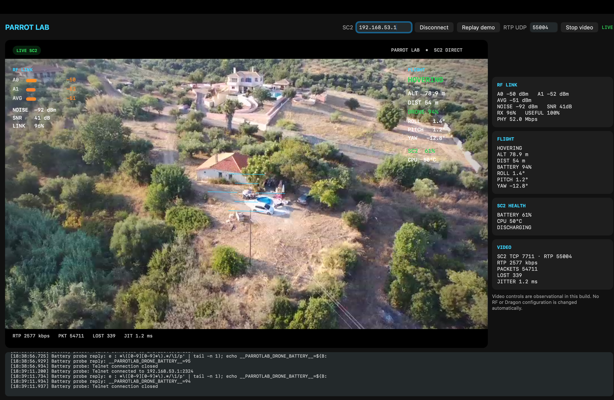

# Parrot Lab

Parrot Lab is an early macOS ground-station and diagnostics app for the Parrot
Bebop 2 and SkyController 2. It talks directly to the controller over USB,
shows the drone camera with a live HUD, and exposes the radio and flight data
we have been using to reverse-engineer the platform.

> **Beta:** this is experimental software for bench testing and development.
> Do not use it as your only flight display or safety system.



## What works

- Direct Apple Silicon Mac-to-SkyController 2 networking over USB-A
- Live Bebop 2 H.264 video relayed by the SC2
- RF chain RSSI, average RSSI, noise, SNR, link quality and PHY rate
- Flight state, distance, altitude, roll, pitch and yaw
- SkyController 2 and Bebop 2 battery telemetry
- Persistent ARSDK navigation telemetry: GPS fix, satellites, speed and last
  known coordinates
- RTP bitrate, packet-loss and jitter diagnostics
- Lossless H.264 recording and source-resolution PNG/JPEG photo capture
- Original full-sensor 4K fisheye JPEG capture directly from the drone
- Mac-side denoise, clarity, low-light cleanup and high-quality 2× enhancement
- Selectable stock 480p and 720p Dragon profiles
- Adjustable 1–16 Mbit/s adaptive or locked stream bitrate
- Integrated, verified installers for Dragon Lab, the RF/MOD Suite and the
  SC2 Apple-NCM driver patch
- Guided SC2 bridge/USB address discovery and RF power-profile controls
- A verified, reversible persistent Telnet/ADB installer for supported Bebop
  firmware files


RF/NVM changes are never applied automatically. Dragon Lab can make an
explicit, landed-only runtime video change after confirmation; it does not
replace the stock binary or persist the profile across a reboot.

See the [changelog](CHANGELOG.md) for this beta's complete update summary.

> **Version 1.2 limitation:** the patched 1080p profile and **Custom · modified
> binary** mode are currently non-functional. Do not use them in this release.
> Unified Bebop 2 firmware support for 4.4.2 and 4.7.1 is planned for version
> 1.3.

## Download the beta

The ready-to-run Apple Silicon build is available from
[GitHub Releases](https://github.com/GiannisTDM/parrot-lab/releases). It is
ad-hoc signed and verified, but it is not Apple-notarized because the project
does not currently use a paid Developer ID certificate.

Extract the ZIP, move **Parrot Lab.app** to `/Applications`, then right-click
the app and choose **Open**. If Gatekeeper still blocks this beta, advanced
users can remove quarantine from this app only:

```sh
xattr -dr com.apple.quarantine "/Applications/Parrot Lab.app"
```

Do not disable Gatekeeper globally. The complete packaging and verification
process is documented in [RELEASING.md](RELEASING.md).

## Tested setup

- Apple Silicon Mac running macOS 13 or newer
- SkyController 2 firmware 1.0.9 (Linux 3.4.11+)
- Bebop 2 connected to the SkyController 2
- Homebrew FFmpeg for the Bebop's cyclic-intra-refresh H.264 stream

Other versions may work, but the included SC2 kernel module is tied to the
tested kernel. Do not load it on a different kernel build without rebuilding
and validating it.

## How it fits together

```text
Parrot Lab on macOS
    |  Apple private NCM over USB (192.168.53.0/24)
    v
SkyController 2 (192.168.53.1)
    |-- TCP 23    SC2 telemetry
    |-- TCP 7711  video-restream setup
    |-- UDP 55004 H.264/RTP video
    `-- TCP 2324  read-only Telnet relay to the Bebop 2
                         |
                         `-- Wi-Fi to 192.168.42.1
```

## Install the SC2 support files

The SC2 must already have Telnet access. Copy the contents of [`sc2`](sc2) to
a writable FTP directory on the controller, then run as root:

```sh
cd /data/lib/ftp/internal_000/parrot-lab-sc2
chmod +x install.sh test.sh unload.sh uninstall.sh
./install.sh
reboot
```

The installer temporarily remounts `/` read/write, installs one short boxinit
service named `plboot`, and restores the root filesystem to read-only. On the
next boot, that service starts:

- the Apple-NCM module needed for Mac USB networking;
- a TCP 2324 relay used only to read drone telemetry.

After reboot, connect the Mac to the SC2 USB-A port. The Mac should receive a
`192.168.53.x` address and should be able to reach `192.168.53.1`.

For a non-persistent test, run `./test.sh ./apple_mac_ncm.ko` instead. See the
[SC2 notes](sc2/README.md) for verification, removal and the persistence bug
that led to the current installer.

## Build and run the Mac app

Install the decoder and build the app:

```sh
brew install ffmpeg
./scripts/build-app.sh
open "$HOME/Applications/Parrot Lab.app"
```

In Parrot Lab, leave the SC2 address at `192.168.53.1`, connect, and start the
video receiver on UDP port `55004`. The **Tools** menu installs or updates the
bundled Dragon Lab, RF/MOD and SC2 driver components, discovers changing SC2
addresses, and exposes the guarded RF profile workflow. Uploads are downloaded
again and verified before the app offers the next step.

Developers can run the test suite directly:

```sh
swift build
.build/debug/ParrotLab --self-test
```

The build script creates an ad-hoc-signed app in `~/Applications` and a
release-ready, independently verified ZIP in `dist/`. FFmpeg is discovered
from Homebrew at runtime. A custom executable
can be embedded by setting `PARROTLAB_FFMPEG=/absolute/path/to/ffmpeg`; anyone
redistributing such a bundle is responsible for complying with FFmpeg's
license and the licenses of the enabled codecs.

## Enable persistent Bebop 2 Telnet

With temporary Telnet already active on a supported Bebop 2 firmware build,
choose **Tools → Enable Persistent Telnet on Bebop 2…**. Parrot Lab uploads and
verifies the installer, makes the stock developer-network script run during
boot, and leaves the root filesystem read-only when it finishes. Telnet and
ADB will then return automatically after a reboot.

The system partition is full on the tested firmware, so the installer moves
the verified stock `tcpdump` binary to the writable `internal_000` storage and
leaves a working symlink at its original path. Both the firmware files and the
resulting edits are checked against known digests; unknown versions are
rejected instead of modified.

> **Security warning:** this enables passwordless root Telnet on the aircraft
> network. Use it only on trusted private networks. To remove the boot change,
> connect to the drone and run:

```sh
sh /data/ftp/internal_000/install_bebop2_persistent_telnet.sh uninstall
```

## Safety and recovery

- Back up the SC2 before installing or editing system files.
- Do the first test on the bench with props removed and the aircraft grounded.
- Keep a working Telnet path until USB networking has been verified after a
  full reboot.
- Use Dragon Lab only while landed, preferably on the bench with props
  removed; it restarts the live camera process.
- Treat RF profile changes as experimental and verify local EIRP rules before
  enabling them.
- Run `/data/lib/parrotlab/uninstall_sc2_apple_ncm.sh`, then reboot, to remove
  SC2 persistence.
- Loading a kernel module built for another kernel can crash the controller.

## Background and acknowledgements

This work was partly inspired by the community-authored
[*An unofficial Bebop drone hacking guide 1.7.2*](https://fargesportfolio.com/wp-content/uploads/2018/01/BeebopHackingGuide1_7_2.pdf).
Its documentation of the Bebop's Linux filesystem, Telnet/FTP access and open
developer tooling remains excellent background material.

Parrot, Bebop and SkyController are trademarks of their respective owner. This
project is independent community research and is not affiliated with Parrot.

## License

The Parrot Lab app and original project files are released under the
[MIT License](LICENSE). The adapted Linux Apple-NCM driver retains its
upstream GPL-2.0-or-BSD-2-Clause choice; see
[third-party notices](THIRD_PARTY_NOTICES.md).
